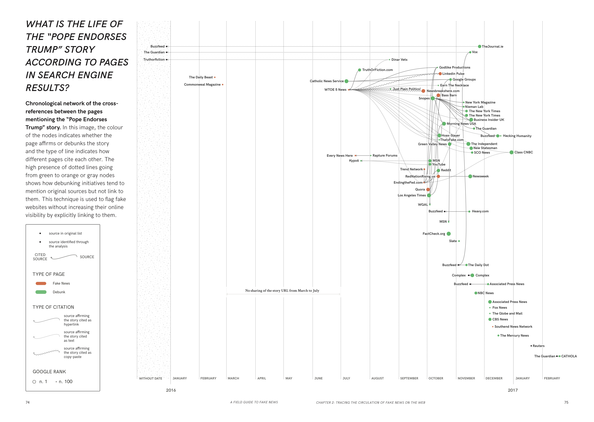
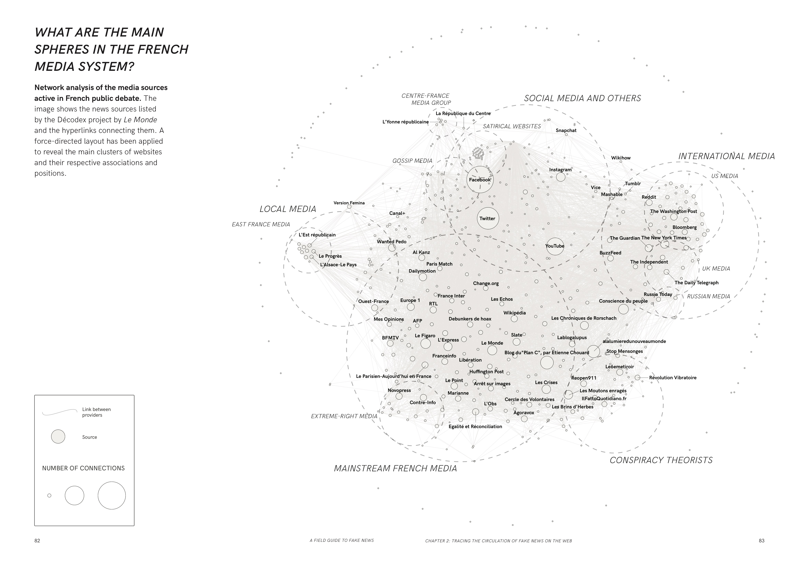
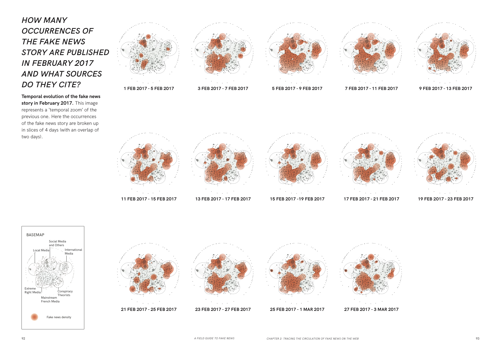

# Chapter 2. TRACING THE CIRCULATION OF FAKE NEWS ON THE WEB 

Where do fake news stories originate?

By which sites are they first disseminated?

Which are the most visible sources related to a fake story?

When and by whom are they mentioned?

## Introduction

Fake news are not just “false news”. They are interesting not so much because their content or form are different from that of “authentic news”, but because they travel as much as (and sometimes more than) mainstream news. If a blog claims that Pope Francis endorses Donald Trump, it's just a lie. If the story is picked up by dozens of other blogs, retransmitted by hundreds of websites, cross-posted over thousands of social media accounts and read by hundreds of thousands, then it becomes fake news.

The following recipes investigate the circulation of fake news for two reasons. Firstly, from a political point of view many have expressed disappointment that techniques and tactics commonly used to tackle fake news have not lived up to expectations. Fact-checking and debunking, in particular, often do not succeed in preventing the circulation of hoaxes and rumors. On the contrary: they can inadvertently contribute to making them even more visible on the web. A better understanding of how fake news travels online can help to inform responses that are more attuned to the phenomena. Secondly, from a methodological point of view, as there is no “ontological” difference between fake and authentic news, studying fake news circulation can help us understand more about how other kinds of news travel.

This recipe comes in two flavours. Firstly, we propose a manual variant which can be executed without the need for any particular tool or technical knowledge. This variant is easy to execute but also time consuming. It is based on a search for web pages referring to fake news stories and on the manual identification of the dates of their publication and the sources that they cite. Secondly, we propose a semi-automated version which allows this approach to be scaled to more pages, but demands more technical skills and may require more manual verification.

## Recipe 2.1: Where do fake news stories originate? By which sites are they first disseminated? 

### Before starting

For this recipe you will need to choose a fake news story whose circulation you would like to trace. The more distinctive your story is, the easier it will be to follow its circulation. In the example, we focus on the “Pope Endorses Trump” story that was widely circulated around the US Elections.

### Step 2.1a: Identify and analyse the occurrences of your story in search engine results

Successful fake news stories always appear on several web pages. In the first step of this recipe, you will identify and collect information about these occurrences.

* Identify the occurrences of your story by querying one or more search engines (we used **`Google Web Search`**). Since fake news stories evolve while circulating, consider keywords that may capture different variants of the story.
* Rely on search engines to rank results by relevance and concentrate on the first results (under the working assumption that they are the ones that circulated the most).
* To avoid "filter bubbles" and personalised results, consider using a dedicated research browser. [1] 
* Be aware that search engines may give more visibility to debunkers than to original sources – and be careful not to overestimate the circulation of debunkers based on this. Also bear in mind that with this approach you see the phenomena “through the eyes” of the search engine that you selected – which will become a part of your story or research.
* Record all relevant metadata for each relevant search result. You can collect as many variables as you like, but make sure to characterise how the page refers to the story (e.g. as a reliable news source, or as a problematic claim to be debunked), as well as some indicator of its “visibility” (e.g. the rank in the search results).

> [1] See instructions on how to set up a research browser in this video tutorial: https://www.youtube.com/watch?v=bj65Xr9GkJM 

### Step 2.1b: Extract the network of references around your stories 

Fake news is supported or opposed through a network of references: websites that share rumours cite other pages to support their claims, while debunking initiatives flag toxic websites or refer to sources denying them. In this step, we will trace the network of references of a specific fake news story.

* Record all sources cited in the occurrences of your story. For each, note down if the source is cited as evidence or counter-evidence and if it is cited through a hyperlink (e.g. http://snopes.com), a textual reference (e.g. “the website WTOE 5 News”) or copying and pasting its content. 
* Make sure you visit not only all the results of your initial search, but also all the sources cited by those results.
* Extract the networks of occurrences and references (you can use **`Table2Net`**).
* Visualise the network (using **`Gephi`**, for instance), applying a force-directed layout; sizing the nodes according to the number of citations they receive; and colouring the nodes according to how they report the story (advocating or debunking).

#### Visualisation 2.1b: How do the occurrences of the “Pope Endorses Trump” story cite each other?

**Network of cross-references between the pages mentioning the “Pope Endorses Trump” story.** In the image the nodes represent the different pages on which the fake story appears. The comparison of the colour of the nodes (which indicates whether the page affirm or debunks the story), their size (which indicates the number of citations received by the page) and their number reveal the great visibility of the debunking and neutral pages compared to websites that spread the fake story as authentic.

### Step 2.1c: Visualise the fake news occurrences over time

The network extracted in the previous step can help you understand not only who cited whom, but also how and in which direction your fake news story travelled. To reveal the circulation use the dates that you collected in the first step of this recipe.

* Chronologically order the network of occurrences extracted in the previous step. You can use different visual styles to represent the different kinds of citations that you have identified. We did this using a custom script of **`Graph Recipes`**.

#### Visualisation 2.1c:  What is the life of the “Pope Endorses Trump” story according to pages in search engine results?

**Chronological network of the cross-references between the pages mentioning the “Pope Endorses Trump” story.** In this image, the colour of the nodes indicates whether the page affirms or debunks the story and the type of line indicates how different pages cite each other. The high presence of dotted lines going from green to orange or gray nodes shows how debunking initiatives tend to mention original sources but not link to them. This technique is used to flag fake websites without increasing their online visibility by explicitly linking to them.

### SERVING SUGGESTIONS

This recipe may be used to repurpose data obtained through search engine results in order to identify and follow the different occurrences of a given fake news story as it is cited and referenced by different online sources, as well as to retrace its circulation over time. You will also be able to see when the debunking activities took place, who promoted them and what effect this had on the circulation of fake news stories and web pages.

## Recipe 2.2:  Which are the most visible sources related to a fake story? When and by whom are they mentioned? 

### Before starting

This recipe enables a scaling up of the approach presented in the previous recipe, but requires a bit more technical knowledge, as well as some bigger datasets. In particular, you will need to have access to:

* A web archive (we used **`Radarly`** by Linkfluence). 
* A list of all the possible web sources in which your chosen fake news story may have appeared (we used the list curated by **`Le Monde Décodex`**).

To illustrate this recipe, we focus on a false story that circulated during the 2017 French presidential election and referred to the presumed homosexuality of Emmanuel Macron.

### Step 2.2a: Define a base map of news providers

Identify (or compile) a list of all the possible Web sources in which you think your fake news item might have appeared (try to be as exhaustive as possible). You can use one of the many lists of fake news websites maintained by debunking initiatives and combine it with a list of mainstream media outlets.

* Identify how the sources in your list are associated with each other through *`web crawling`* and hyperlink analysis. We used **`Hyphe`** for this.
* Visualise the resulting network and apply a force-directed layout algorithm to identify clusters of sources. You can use **`Gephi`** for this task.
* Manually highlight and name the clusters.

#### Visualisation 2.2a: What are the main spheres in the French media system?

**Network analysis of the media sources active in French public debate.** The image shows the news sources listed by the Décodex project by Le Monde and the hyperlinks connecting them. A force-directed layout has been applied to reveal the main clusters of websites and their respective associations and positions.

### Step 2.2b: Highlight the occurrences of your story on the base map

In this step we will explore how fake news stories are associated with different sources. This is interesting, as while a fake news story might – for example – start out its life as a piece of satire, as it travels it can become more prominently associated with non-satirical sources. Here we will identify which of the sources in the base map of the French media system are mentioned in the pages in which your fake news story occurs.

* Create a query that identifies the fake news story that you want to trace. Use keywords specifically associated with your story and the stop-words to exclude "false positives".
* Identify the occurrences of your story, running your query on the archive that you have chosen to use. For each of the results, collect the full text and the date of publication.
* Detect, in the occurrences of the story, mentions of the sources of your base map. Search for for the URLs as well as for the names of your sources (e.g. sputniknews.com, Sputnik). In our example we used a custom script for **`CSV Rinse Repeat`**. 
* Project the occurrences of your story onto your base map, by connecting each of them to the sources that they mention. While keeping the source-nodes fixed, apply a force directed spatialisation algorithm (you can do this using **`Gephi`**) to move the nodes representing the fake story occurrences closer to clusters of the base map that they cite the most.

#### Visualisation 2.2b: Which are the sources cited in the occurrences of the fake news story?

**Projection of the fake news occurrences on the network of media sources.** In this image, the occurrences of the fake news story are positioned on the base map displayed by the previous network according to the sources they cite. The tendency to refer to social media is visible as well as the relevance of *Russia Today* and *Sputnik International* in this particular story.

### Step 2.2c: Visualise the spread of your fake story on the base map

In this step, you will reveal how the reference patterns identified in the previous step evolve over time.

* Slice your network of occurrences and references by month, by week or by day, according to the speed of circulation of your story. In this example we grouped news by month and then zoomed in on a four day window to explore the most important period of circulation.
* While keeping the source base map stable, visualise the different temporal slices of fake news story occurrences.
* In order to make the changes and patterns more legible, you can represent the fake story occurrences not as single nodes, but through a density heatmap (the example has been produced using a custom script in **`Graph Recipes`**).

#### Visualisation 2.2c: How many occurrences of the fake news story are published in each period and what sources do they cite?

**Temporal evolution of the fake news story in the whole observed period.** In this image, the occurrences of the fake news story are divided in slices of four weeks (with an overlap of two weeks) and represented as a density heat map rather than as individual points. Though mentions of the story have been present for more than one year, its circulation appears to spike in February 2017, when a new strand of the fake story is published by the Russian website Sputnik International.

#### Visualization 2.2d: How many occurrences of the fake news story are published in February 2017 and what sources do they cite?

**Temporal evolution of the fake news story in February 2017.** This image represents a ‘temporal zoom’ of the previous one. Here the occurrences of the fake news story are broken up into slices of 4 days (with an overlap of two days).

### SERVING SUGGESTIONS

This recipe may be used to identify which websites reference a fake news story most often in different spheres. These are not necessarily the original sources of the fake news, but are often the most influential media outlets that contribute to its circulation (whether as a rumour or as a debunked story).
