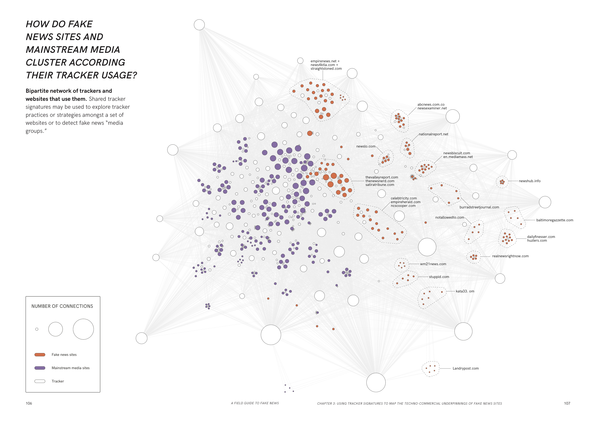
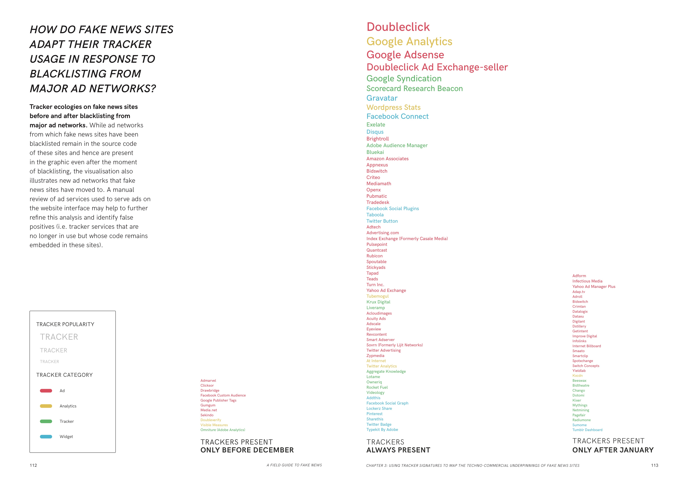
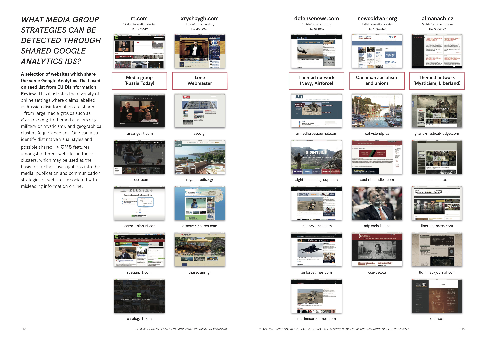
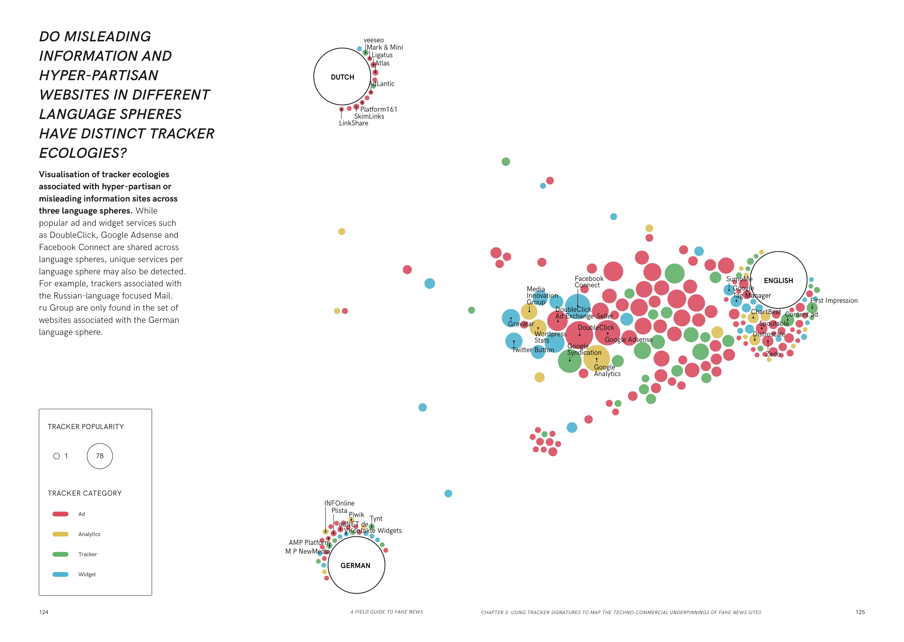

# Chapter 3. USING TRACKER SIGNATURES TO MAP THE TECHNO-COMMERCIAL UNDERPINNINGS OF FAKE NEWS SITES

Do fake news sites use different kinds of trackers from mainstream media sites?

How can fake news and mainstream media sites be profiled based on their tracker usage?

How do tracker ecologies on fake news sites change over time?

Which other websites share the same tracker IDs as fake news sites?

Do trackers associated with hyper-partisan, and misleading information sites vary across language spheres?

## Introduction

Over the past few decades many responses to misinformation and disinformation have focused on mapping and debunking claims made or repeated by politicians, journalists or other public figures. What are the prospects of mapping fake news online not just by looking at the circulation of claims, but by examining the technical infrastructures of the websites through which these claims are published?

Many websites use “trackers” – small bits of embedded code – in order to monitor engagement, including visitor numbers, visitor behaviour and the effectiveness of ads. In this section we look at how data about web trackers can be repurposed in order to investigate the technical and commercial underpinnings of websites associated with fake news and other misleading information phenomena.

## Recipe 3.1: Do fake news sites use different kinds of trackers from mainstream media sites?

## Before starting

For this recipe you will need two lists of URLs: one list of fake news URLs and one list of mainstream media URLs. How these lists are obtained is a crucial part of the research process. You can either draw on existing lists, or create your own (e.g. by compiling a selection, triangulating from other sources, or obtaining from different platforms or media sources). The starting point that you choose will affect how to read and what you can do with the results. To illustrate this recipe, we start with a selection of fake news pages obtained from a list created by *`BuzzFeed News`* (ordered by most engaged with content according to the **`BuzzSumo`** tool), as well as a list of mainstream media web pages obtained by triangulating lists from `*BuzzFeed News*` and *`Alexa`*.

### Step 3.1a: Calculate tracker usage per site type

From the *`source code`* of web pages it is often possible to see which third-party tracking services are used.

* Collect data about trackers associated with the web pages on each list. You may use the **`DMI Tracker Tracker`** tool to collect this information.
* Count the usage of each tracker in fake news websites and in mainstream news websites. 
* You may use a *`scatter plot`* to visualise the resulting data. Each circle represents one tracker coloured by category. On the horizontal axis, you can show, for example, the distribution of trackers usage by mainstream media and fake news websites. On the vertical axis, you can indicate the overall usage of the tracker. We used the **`RAWGraphs`** tool to generate this visualisation.

#### Visualisation 3.1a: Do mainstream media and fake news websites share the same tracker ecologies?

**Scatterplot representing tracker usage on a series of fake news and mainstream media sites.** While fake news sites and mainstream media sites share popular tracker services such as Google Adsense, DoubleClick and Google Analytics, mainstream media sites appears more mature and sophisticated in its use of trackers in terms of the number and diversity of trackers that it uses.

### SERVING SUGGESTIONS

This recipe can be used to profile the tracking practices associated with different kinds of websites – including which trackers are either mainly or exclusively associated with fake news websites and what these trackers do – as well as identifying most commonly used trackers. It can also be used for exploring the “long tail” of smaller and more specialised trackers.

## Recipe 3.2: How can fake news and mainstream media sites be profiled based on their tracker usage?

### Before starting

For this recipe you will need two lists of URLs: one list of fake news URLs and one list of mainstream media URLs. How these lists are obtained is a crucial part of the research process. You can either draw on existing lists, or create your own (e.g. by compiling a selection, triangulating from other sources, or obtaining from different platforms or media sources). The starting point that you choose will affect how to read and what you can do with the results. To illustrate this recipe, we start with a selection of fake news pages obtained from a list created by *`BuzzFeed News`* (ordered by most engaged with content according to the **`BuzzSumo`** tool), as well as a list of mainstream media web pages obtained by triangulating lists from `*BuzzFeed News*` and *`Alexa`*.

### Step 3.2a: Graph relations between pages and trackers

In order to explore how different URLs share the same patterns of tracker usage we can create a network graph to highlight associations between web pages to their corresponding trackers. 

* Extract lists of trackers associated with the initial lists of fake news and mainstream media pages. You may use the **`DMI Tracker Tracker`** tool to collect this information.
* Create a network in order to show the tracker usage patterns of the different web pages. We used **`Gephi`** in order to visually explore the network using a *`force directed network`* layout to help read the data.
* You can annotate the network graph in order to highlight the clusters of URLs (e.g. fake news clusters, or mainstream media clusters).

#### Visualisation 3.2a: How do fake news sites and mainstream media cluster according their tracker usage?

**Bipartite network of trackers and websites that use them.** Shared tracker signatures may be used to explore tracker practices or strategies amongst a set of websites or to detect fake news “media groups.”

### SERVING SUGGESTIONS

This recipe can be used to explore how a set of web pages can be grouped based on their tracker signatures. This provides a complementary picture to lists or metrics (e.g. of most and least used trackers across the pages) by facilitating exploration of relations between trackers and websites. For example it could be used as a starting point to identify potential fake news “media groups” for further investigation, or to explore the different web tracking practices, styles and footprints of fake news web pages – including comparisons between pages associated with different regions, issues or sources.

## Recipe 3.3: How do tracker ecologies on fake news sites change over time?

### Before starting

For this recipe you will need the *`source code`* of the same web page (or set of web pages) at two different moments in time. You can obtain saved copies of the same page over time (e.g. through manually or automatically saving the source code yourself) or you can use public web archiving projects such as the Internet Archive’s **`Wayback Machine`**.

### Step 3.3a: Graph relations between pages and trackers

This recipe can be used to identify which trackers were being used by a given web page at different moments in time. It might be useful to chart changes in tracking practices – for example by examining the impact and responses to events like Google and Facebook’s bans of fake news providers from their ads programs in November 2016.

* Obtain archived copies of a webpage. You may use the **`Wayback Machine`** to see how a given page changed over time.
* Identify associated trackers with the current and previous version of the page. You may use the **`DMI Tracker Tracker`** tool to collect such information.
* Identify the trackers which are only present on the first date, the ones that which are only present on the second date and the ones that are shared across both dates.
* You can group trackers into three lists, colouring them accordingly.

#### Visualisation 3.3a: How do fake news sites adapt their tracker usage in response to blacklisting from major ad networks? 

**Tracker ecologies on fake news sites before and after blacklisting from major ad networks.** While ad networks from which fake news sites have been blacklisted remain in the source code of these sites and hence are present in the graphic even after the moment of blacklisting, the visualisation also illustrates new ad networks that fake news sites have moved to. A manual review of ad services used to serve ads on the website interface may help to further refine this analysis and identify false positives (i.e. tracker services that are no longer in use but whose code remains embedded in these sites).

### Serving suggestions

Given debates and proposals about stopping the ad revenue of fake news, this recipe may be used to understand how fake news websites are adapting to the measures taken by trackers services, technology companies and advertisers – as well as how effective these measures are. For example, it can show which trackers have been dropped, which remain and which are added at different moments in time.

## Recipe 3.4: Which other websites share the same tracker IDs as fake news sites?

### Before starting

Before you start you will need to compile or identify seed lists of fake news and other misleading information websites. We illustrate this recipe by examining which websites use the same **`Google Analytics IDs`** as a list of websites from the EU Disinformation Review.

### Step 3.4a: Identify websites which share tracker IDs with a seed list of pages or sites

This recipe can be used to identify which other websites share the same tracker IDs as web pages on a given list.

* Extract the Google Analytics ID for each URL in your starting list. You can do this manually (e.g. by looking in the *`source code`* for a string in the form “UA-xxxxxxx”) or automatically through *`web scraping`* or other tools (in this example we wrote a custom script in order to extract this information from the metadata of the website).
* Obtain a list of pages associated with the same ID. We used the *`API`* of **`spyonweb.com`** to get this information.
* Take a screenshot of each web page. We used a script to automate the process of obtaining screenshots, in order to visually compare the different websites to identify different kinds of media groups.
* Place together screenshots of pages with the same ID to spot differences and similarities between websites across and within groups.

#### Visualisation 3.4a: What media group strategies can be detected through shared Google Analytics IDs?

**A selection of websites which share the same Google Analytics IDs, based on seed list from EU Disinformation Review.** This illustrates the diversity of online settings where claims labelled as Russian disinformation are shared – from large media groups such as *Russia Today*, to themed clusters (e.g. military or mysticism), and geographical clusters (e.g. Canadian). One can also identify distinctive visual styles and possible shared **`CMS`** features amongst different websites in these clusters, which may be used as the basis for further investigations into the media, publication and communication strategies of websites associated with misleading information online.

## Recipe 3.5: Do trackers associated with hyper-partisan, and misleading information sites vary across language spheres?

### Before starting

For this recipe, you will need lists of fake news, hyper-partisan or misleading information sites in different language spheres in order to compare their trackers and tracking practices. We illustrate this recipe with reference to hyper-partisan, fake news and misleading information sites in Dutch, English and German language spheres.

### Step 3.5a: Identify trackers per language sphere

* Extract trackers associated with lists of the web pages for each language sphere. We did this using the **`DMI Tracker Tracker`** tool.
* Identify the trackers which are shared across and which are unique to different languages spheres within the dataset. We did this using the **`DMI Triangulation`** tool.
* You can illustrate the results using the visual metaphor of magnets. Each of the three languages are represented on the corner of a triangle. The trackers are distributed in the triangle according to their usage: if a tracker is used by all three languages it will appear in the middle, if it is used by two languages the tracker will be placed on the edge between the two and so on.

#### Visualisation 3.5a: Do misleading information and hyper-partisan websites in different language spheres have distinct tracker ecologies?

**Visualisation of tracker ecologies associated with hyper-partisan or misleading information sites across three language spheres.** While popular ad and widget services such as DoubleClick, Google Adsense and Facebook Connect are shared across language spheres, unique services per language sphere may also be detected. For example, trackers associated with the Russian-language focused Mail.ru Group are only found in the set of websites associated with the German language sphere.

### Serving suggestions

This recipe can be used to identify trackers for further investigation – including language sphere specific and cross-language trackers. It may help to provide lines of inquiry for looking into what is distinctive about the commercial and technical underpinnings of fake news in different language spheres.