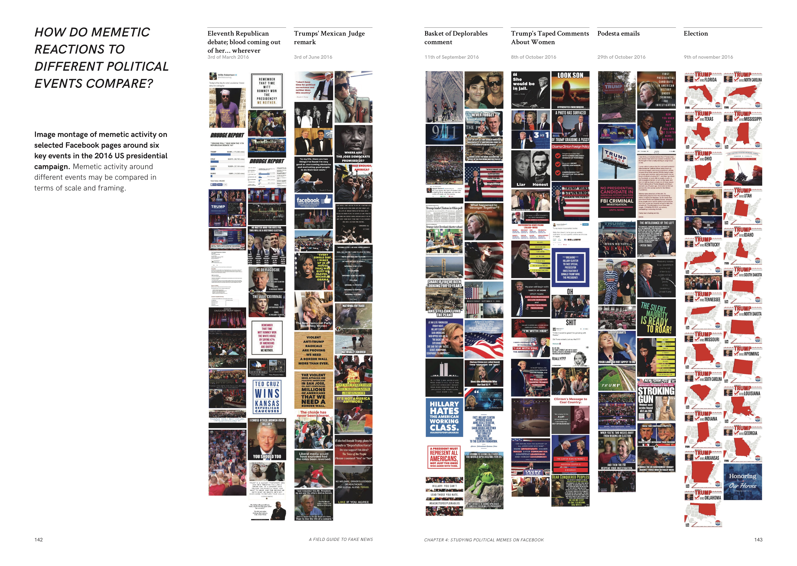
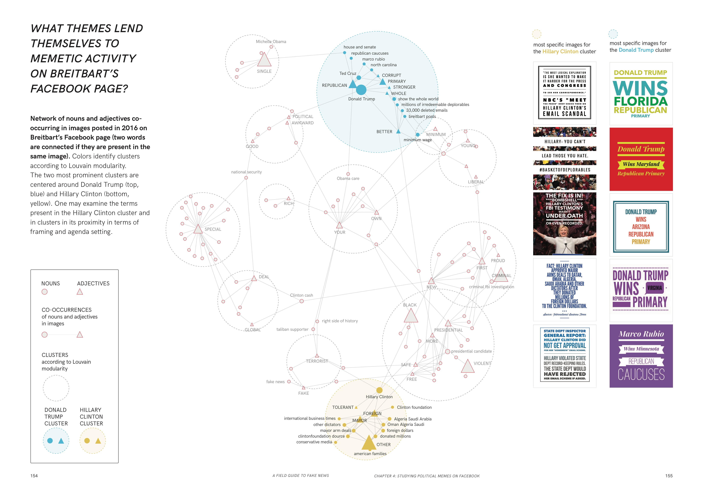
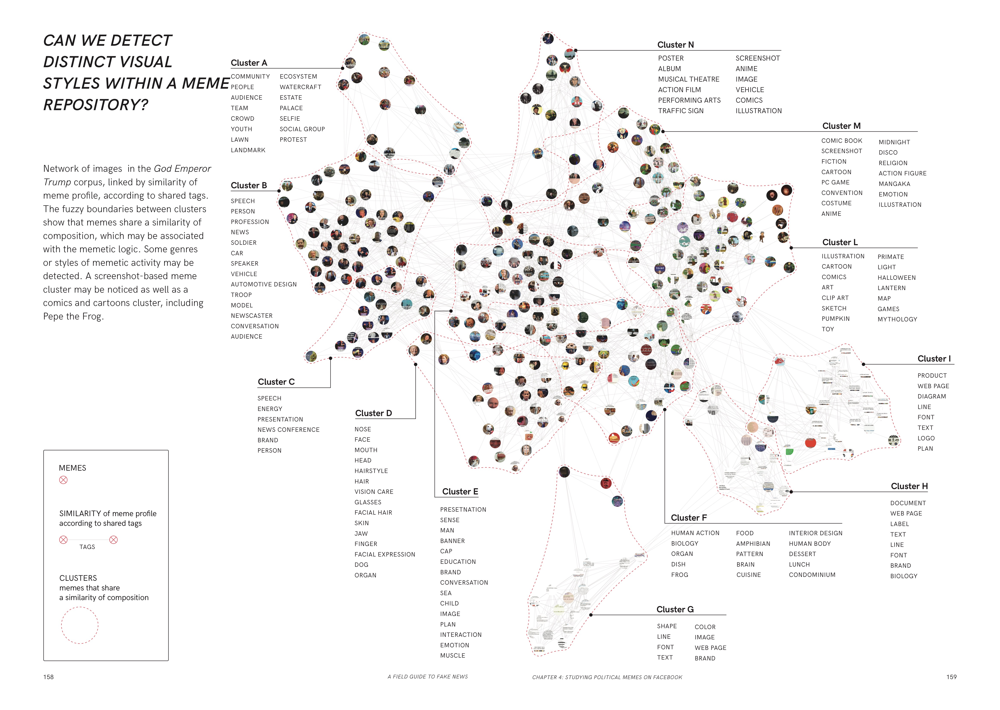

# Chapter 4: Studying Political Memes on Facebook

How can meme spaces on Facebook be traced?

How do memes frame political and media events?

How may the content of memes be studied?

## Introduction

So far the recipes in this guide have focused on media artefacts which mimic the news genre. But successful hyper-partisan content, misinformation, disinformation and propaganda do not always look and feel like news pages with the familiar combination of headlines, pictures and text that we see in sites like the *BBC*, *CNN* and countless other outlets. In fact images, and particularly image-based memes, circulate just as well (if not better) in social media ecosystems.

According to a  piece for the *Columbia Journalism Review*, the media format which generated most engagement on *Breitbart*’s Facebook page is the image-meme [1]. Hence, it is essential to consider not just how fake news pages but also other kinds of viral content genres such as memes participate in political agenda setting, political processes and political culture. 

This section provides a set of approaches to investigate political memes. We focus on memes that take political topics, actors and events as their object. The case study used to illustrate these approaches is alt-right and pro-Trump memetic activity on Facebook around the 2016 US presidential election. We shall use the term "memetic activity" in this section to designate the multiple ways in which users act around memes online, including circulating, imitating and transforming them. The first recipe focuses on how to identify and map meme spaces on Facebook. The second recipe explores ways to investigate how Facebook users engage with political events through memetic activity.The third and final recipe provides a series of approaches for analysing the content of memes. 

>  [1] See, Nausicaa Renner, “Memes Trump articles on Breitbart’s Facebook page”, *Columbia Journalism Review*: 2017. Available at: http://www.cjr.org/tow_center/memes-trump-articles-on-breitbarts-facebook-page.php 

## Recipe 4.1: How can meme spaces on Facebook be traced?

### Before starting

To investigate who engages with memes around a political issue of interest on Facebook, you should start by identifying a page with significant following and memetic activity around your topic of interest. As an example, we selected the *Disdainus Maximus* page, which is very active in pro-Trump and alt-right activity. We traced the network of connections around this page and explored its topology.

### Step 4.1a: Identify the network of ties around a chosen Facebook page

To trace the network of affinities around a Facebook page we followed the “likes” from our page to other pages (to be distinguished from the "likes" received from users).

* A Facebook crawler may be used to extract the “likes” network around a page. We used  **`Netvizz`**’s “page like network” module to “create a network of pages connected through the likes between them.” [1]
* We set the crawler to a depth of two to extract the pages liked by our seed page and those liked by them. We thus obtained a directed network file where nodes are pages and edges represent acts of liking. 
* You may use a network analysis tool such as **`Gephi`** to examine the graph of interconnected Facebook pages. A force-directed layout algorithm (such as ForceAtlas2) can help you visualise the shape of the network and explore the interconnected space of memetic activity.

> [1] See Netvizz, Facebook application, version: 1.3, 2017, at: https://apps.facebook.com/netvizz/ 

### Step 4.1b: Profile the issues and themes that animate the memetic space 

This step consists of qualitative and quantitative analysis of the composition and arrangement of the network of Facebook pages obtained in the previous step. The configuration of the *`network graph`* may be qualitatively and quantitatively analysed to identify prominent clusters and nodes. This step may include:

Quantitatively, by:

- Identifying which pages are most popular in the network by using a graph metric such as indegree, i.e. the count of the likes received from other pages in the network. 
- Identifying the pages most active in liking other pages by using a graph metric such as outdegree, i.e. the count of likes given to other pages in the network.
- Identifying which pages bridge or connect different clusters in the network by using a graph metric such as betweenness centrality.
- Identifying which pages are most popular among Facebook users by using the Facebook’s “fan count” metric.

Qualitatively, by:

* Identifying prominent clusters by visually exploring the shape and density of nodes groupings in the graph. 
* Examining the content shared by the pages in the network as well as their titles and self-descriptions to identify shared issues of concern within each cluster.

To increase readability of the network map you may annotate it with the resulting thematic classification of the clusters.

#### Visualization 4.1.b: What issues animate the inter-liked Facebook page network seeded by a pro-Trump political meme repository?

**Network of inter-liked Facebook pages seeded from the pro-Trump meme repository *Disdainus Maximus*.** The network comprises 751 pages featuring memetic activity. Pages are connected through ties representing likes among them.The network is spatialised with a force-directed layout algorithm. Another algorithm, modularity, is used to identify clusters. Nodes are sized according to the number of likes received and coloured according to their follower count. Pro-Trump memes are prominent within the Facebook meme culture, as shown by the fact that even the pages which are not politically oriented share ties with pages circulating pro-Trump memes (as well as with pages dedicated to various forms of nationalism and populism). The presence of Donald Trump’s official page at the center of the network may indicate that his image plays an energising role in the alt-right meme space.

### SERVING SUGGESTIONS

This recipe may be used to identify political meme repositories on Facebook and the relations between them as well as the themes that lend themselves to memefication.

## Recipe 4.2: How do memes frame political and media events?

### Before starting

To identify how memes frame political or media events the first step is to identify the events to be examined. To illustrate this recipe we used the following key events associated with the US elections:

| Date              | Description                              |
| ----------------- | ---------------------------------------- |
| March 3, 2016     | The eleventh Republican debate           |
| June 3, 2016      | Trumps’ Mexican judge remark             |
| September 9, 2016 | Clinton’s ‘basket of deplorables’ comment |
| October 8, 2016   | Trump’s taped comments about women       |
| October 29, 2016  | Podesta emails                           |
| January 27, 2017  | Trump announces first travel ban         |

### Step 4.2a: Identify memes related to events

To illustrate this recipe we use a sub-selection of 46 pages from the corpus identified in recipe 4.1. The selection was done based on a set of qualitative and quantitative criteria, including their *`engagement`* counts and the thematic cluster that they belong to. 

* Define a timeframe for meme selection. For this analysis, we selected three days starting with the date of the event under examination.
* Extract a list of memes posted to your corpus of pages in the selected timeframe. You may use a tool such as **`Netvizz`** to collect a list of images and related metadata.
* Download the images for each URL. You may use a browser extension such as **`Tab Save`** for Chrome or **`DownThemAll!`** for Firefox.
* Visually juxtapose the images grouping them by event to enable comparison of memetic reactions across events. You may use an image montage tool such as **`ImageJ`** (4.2.a).
* You can also explore how different pages react to a single event to enable comparison across pages (4.2.b).

#### Visualization 4.2.a: How do memetic reactions to different political events compare? 

**Image montage of memetic activity on selected Facebook pages around six key events in the 2016 US presidential campaign.** Memetic activity around different events may be compared in terms of scale and framing.

#### Visualization 4.2.b: How do memetic reactions around a single political events compare across Facebook pages? 

**Image montage of a particular interpretative frame prominent in memetic activity around Trump’s taped comments about women across a set of pro-Trump Facebook pages.** The visualisation shows how a number of pages pointed to a particular image of Bill Clinton confronted with alleged victims of sexual harassment from his own past in response to the “groping tape” event. Notably, this interpretative frame appears consistent with the frame proposed by *Breitbart*.

### SERVING SUGGESTIONS

This recipe may be used to explore participatory production of visual culture around political events and how it contributes to agenda-setting efforts.

## Recipe 4.3: How may the content of memes be studied?

### Before starting

The recipe illustrates techniques to support content analysis of texts and images contained in memes as well as the detection of genres or styles of memetic activity.
As examples, we use two Facebook pages which feature pro-Trump memes: *Breitbart* and *God Emperor Trump*. Even if the images posted to these pages do not comply with classic meme formats (e.g. image macros), they exhibit memetic features such as virality, user-driven remixing, imitation and intertextuality. Breitbart has been selected due to its central role in animating the alt-right culture [1]. The *God Emperor Trump* page is one of the most popular pro-Trump, alt-right meme pages with over 245,000 likes and *`followers`* as of the time of writing. In *Breitbart* only the page administrator can post images, while in *God Emperor Trump* users may submit their productions to the administrator for posting. 

> [1] Y., Faris, R., Roberts, H., & Zuckerman, E. (2017, March 3). Study: Breitbart-led right-wing media ecosystem altered broader media agenda. Retrieved March 8, 2017, from http://www.cjr.org/analysis/breitbart-media-trump-harvard-study.php

### Step 4.3a: Create a corpus of images posted to the chosen Facebook page and their associated metadata

To create a corpus choose a timeframe of interest (for instance the days around a particular political or media event - see recipe 4.2) or use all images posted to a Facebook page.

* The Facebook *`API`* enables the extraction of metadata associated with images posted to a page and available via the “Photos” tab.

* Metadata capture may be done with a data extraction tool such as **`Netvizz`**, using the “page timeline images” module.
* The outcome of running **`Netvizz`**’s “page timeline images module” is a tab-separated file containing metadata associated with each image, including its creation date, its URL and its "likes", reactions and comment count. 
* A browser extension such as **`Tab Save`** for Chrome or **`DownThemAll!`** for Firefox may be used to download the images.
* To extract the text contained within each image you may run the images through some optical character recognition (OCR) software. For this recipe, we used **`Google's Vision API`** and a script feeding the list of image URLs to the Vision API [2]. 
* You may also use a piece of image analysis software to generate additional metadata for your corpus of images through the detection and labelling of entities, objects and attributes.

> [2] See memespector script written by Bernhard Rieder, University of Amsterdam, at https://github.com/bernorieder/memespector

### Step 4.3b: Examine themes exploited in the corpus of memes with text analysis (experimental)

To examine the issues that trigger memetic activity you may analyse the text extracted from the images through manual qualitative analysis or semi-automated semantic analysis. The results of this analysis are affected by the quality of the OCR. A computational linguistics tool (e.g. **`CorText`**) can be used, but the analyst’s judgement remains crucial to evaluate the relevance of the extracted terms and to set the parameters of the tool (what algorithms to use, what types of words to keep, how frequently should they occur, etc.).

* Lexical analysis may help you identify the most relevant terms used in your memes. 
* You may also run queries on the OCR outputs to explore the resonance of particular issues.
* Analysis of term co-occurrences across the corpus of memes allows you to explore the main themes within the corpus and their relationships. The network of term co-occurrence may be visually explored in order to identify prominent thematic clusters and the relationships between them and identify how key political issues are articulated through associations of terms in memes.

#### Visualization 4.3.b: What themes lend themselves to memetic activity on Breitbart’s Facebook page?

**Network of nouns and adjectives co-occurring in images posted in 2016 on *Breitbart*’s Facebook page (two words are connected if they are present in the same image).** Colors identify clusters according to Louvain modularity. The two most prominent clusters are centered around Donald Trump (top, blue) and Hillary Clinton (bottom, yellow). One may examine the terms present in the Hillary Clinton cluster and in clusters in its proximity in terms of framing and agenda setting.

### Step 4.3c: Examine visual styles of memes with image analysis

To explore the visual styles deployed in a meme repository, the outputs of the image analysis software described in step 4.2.a may be used, namely the labels or tags generated to describe the entities and attributes detected in our image corpus. We illustrate this analysis on the *God Emperor Trump* page. 

* Images are analysed with Google Vision to extract tags describing the images and textual content.
* We used **`CorText`** to examine associations between images based on shared labels. 
* The configuration of the *`network graph`* may be visually explored in order to identify and describe visual styles per cluster. 
* This operation may be repeated with different pages to compare their different style.

#### Visualization 4.3.c: Can we detect distinct visual styles within a meme repository? 

**Network of images  in the *God Emperor Trump* corpus, linked by similarity of meme profile, according to shared tags.** The fuzzy boundaries between clusters show that memes share a similarity of composition, which may be associated with the memetic logic. Some genres or styles of memetic activity may be detected. A screenshot-based meme cluster may be noticed as well as a comics and cartoons cluster, including Pepe the Frog.

### SERVING SUGGESTIONS

This recipe may be used to explore how memes frame political issues, events and personalities, in what may be considered a form of “participatory propaganda” [3]

> [3] See, Alicia Wanless, “Have You Fallen Down a Participatory Propaganda Rabbit Hole?”, Politcs Means Politics, at: https://politicsmeanspolitics.com/have-you-fallen-down-a-participatory-propaganda-rabbit-hole-6f71c83f04fa