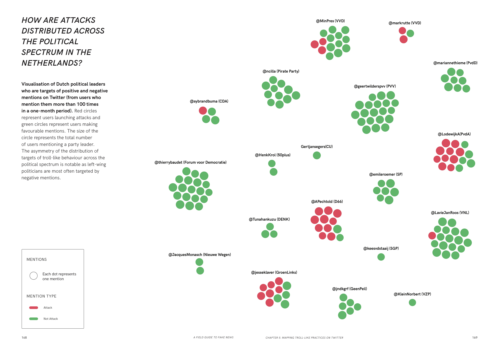
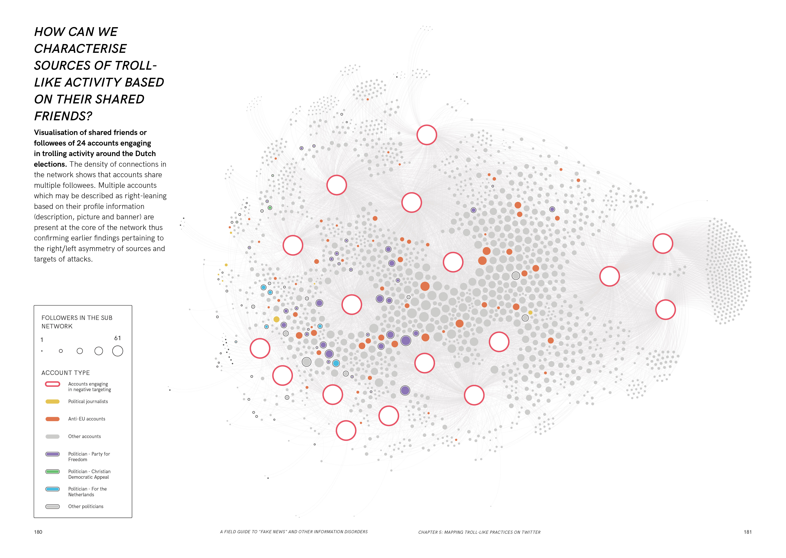
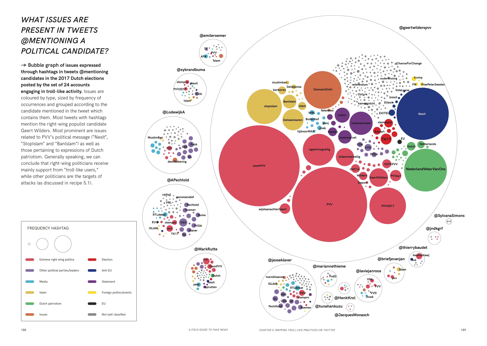
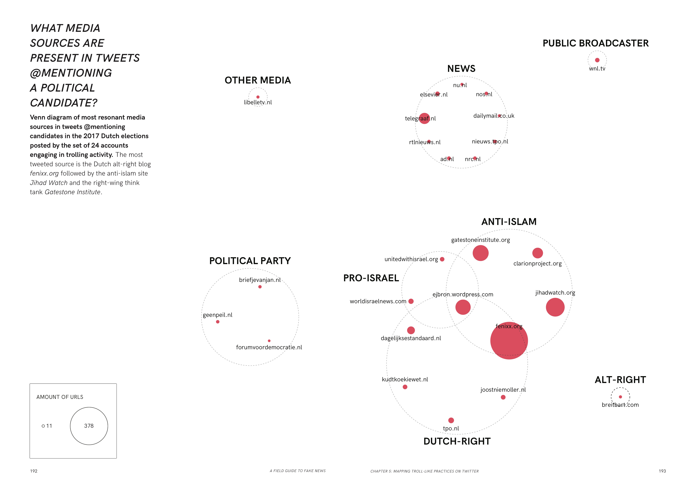

# Chapter 5: Mapping troll-like practices on Twitter

How may we detect Twitter accounts which negatively target political representatives?

How may we characterise the sources of troll-like activity?

How may troll-like practices be characterised?

## Introduction

Tactics such as trolling and the use of bots and “sock-puppet” accounts have been linked to the spread of political disinformation and propaganda online [1]. In the lead up to the 2017 general elections for the Dutch parliament, journalists pointed to the use of sock puppets (i.e. false online identities assumed to deceive and influence opinion) by some political parties to amplify their messages online and to attack their political opponents on social media [2].

In this recipe set we provide some methods that can be employed to detect and profile misleading information practices by taking troll-like behaviour around the 2017 Dutch election campaign as a case study. We focus on political troll-like practices, a term which we use in the narrower sense of attacks addressed at political representatives.

We focus on three aspects of political trolling: the sources of troll-like activity, the characteristics of these practices and their targets. 

> [1] See, for example, Alice Marwick and Rebecca Lewis, “Media Manipulation And Disinformation Online”, Data Society, May 2017: https://datasociety.net/output/media-manipulation-and-disinfo-online/
>
> [2] See, Andreas Kouwenhoven and Hugo Logtenberg, “Hoe Denk met ‘trollen’ politieke tegenstanders monddood probeert te maken”, NRC, 2017. Available at: https://www.nrc.nl/nieuws/2017/02/10/de-trollen-van-denk-6641045-a1545547

## Recipe 5.1: How may we detect Twitter accounts which negatively target political representatives?

### Before starting

To detect political troll-like activities and their sources, you should start from compiling a list of potential targets, for instance a set of Twitter accounts associated with political representatives. We used a set of 28 Twitter accounts associated with the leaders of parties participating in the 2017 Dutch general elections.

### Step 5.1a: Identify who negatively targets political leaders on Twitter

To identify who negatively mentions a political leader on Twitter start from identifying all references of a political leader account on Twitter. Following Twitter practices, you can operationalise references with "mentions" defined by the “@” sign. 

* Capture all @mentions of a set of accounts. We used a Twitter data extraction and analysis toolset called **`TCAT`**. 
* We capture all tweets mentioning at least one of the 28 political leader Twitter accounts between 8 February and 8 March 2017, the month before the Dutch general elections. The result is a collection of 519,245 tweets which we use in all the recipes in this set. 
* To identify the most active “mentioners”, find all the accounts mentioning one of the target accounts more than a given threshold. In our example, we retained the accounts mentioning one of the political leaders more than 100 times in our dataset.
* Examine mentions by most active “mentioners” identified in the previous step to qualify the nature of each of their references (i.e. whether it is in support of the political leader or negatively targeting them).
* Retain only the users who consistently negatively target one or more political representatives (in our case we narrowed down our list to 25 users).

#### Visualization 5.1.a: How are attacks distributed across the political spectrum in the Netherlands?

**Visualisation of Dutch political leaders who are targets of positive and negative mentions on Twitter (from users who mention them more than 100 times in a one-month period).** Red circles represent users launching attacks and green circles represent users making favourable mentions. The size of the circle represents the total number of users mentioning a party leader. The asymmetry of the distribution of targets of troll-like behaviour across the political spectrum is notable as left-wing politicians are most often targeted by negative mentions.

### SERVING SUGGESTIONS

This recipe can be used to identify sources of personal attacks on Twitter and can be extended beyond the context of political trolling.

## Recipe 5.2: How may we characterise the sources of troll-like activity? 

### Before starting

For this recipe we take as a starting point the 25 accounts that mention at least one political leader at least 100 times identified in the previous recipe (we discarded one account because it was no longer active).

### Step 5.2.a: Characterise sources of troll-like activity through their profile information

One way in which you can characterise the sources of troll-like activity is by examining their profile information. 

* Visit each of the accounts and collect their profile information from the Twitter interface (description, profile picture and banner).
* Analyse this information in order to identify political issues, hashtags mentioned and affiliations. 
* Take note of the presence or absence of profile images and upload any images identified to **`Google Image Search`**  to detect whether any of the accounts use fake profile images.
* Using the Twitter *`API`*, extract the creation date of the account and examine whether several accounts in your corpus have been created around the same date.

#### Visualization 5.2.a: How can we characterise sources of trolling activity based on their profile information?

**Clustering of 24 accounts engaging in troll-like activity around the Dutch elections.** The profile information is clustered according to similarities. Three users have very similar profiles and are created in a short amount of time: this helps us to identify them as ‘sock-puppet’ account created for trolling activities. Other six promote the same anti-islam agenda, but without being fake accounts.

### Step 5.2b: Characterise sources of trolling activity through their friends

Another way in which sources of troll-like activity may be characterised is by examining who they follow on Twitter, also known as their friends.

* Use the "GET friends/ids" function of the Twitter API to extract the IDs of all users followed by the trolling-accounts you have identified. [1]
* Use the "GET users/lookup" function of the Twitter API to retrieve the profile information for each friend. [2]
* Use **`Table2Net`** to convert the table containing the studied accounts and their friends in a network of  Twitter accounts connected by the “friendship” relationships between them.
* You may use a network analysis and visualisation tool such as **`Gephi`** to explore the shared friends or followees between the accounts engaging in troll-like practices.

> [1] See Twitter Developer Platform, API reference: GET friends/ids, 2017, at: https://developer.twitter.com/en/docs/accounts-and-users/follow-search-get-users/api-reference/get-friends-ids 

> [2] See Twitter Developer Platform, API reference: GET users/lookup, 2017, at: https://developer.twitter.com/en/docs/accounts-and-users/follow-search-get-users/api-reference/get-users-lookup

#### Visualization 5.2.b: How can we characterise sources of troll-like activity based on their shared friends?

**Visualisation of shared friends or followees of 24 accounts engaging in trolling activity around the Dutch elections.** The density of connections in the network shows that accounts share multiple followees. Multiple accounts which may be described as right-leaning based on their profile information (description, picture and banner) are present at the core of the network thus confirming earlier findings pertaining to the right/left asymmetry of sources and targets of attacks.

### SERVING SUGGESTIONS

This recipe may be used to profile trolling accounts in the context of other political campaigns.

## Recipe 5.3: How may troll-like practices be characterised?

### Before starting

For this recipe, take as a starting point the accounts identified in the previous recipes and the tweets posted from these accounts in the timeframe of the study (see recipe 5.1).

### Step 5.3.a: Investigate the hashtags that sources of troll-like activity use 

To identify what issues are associated with troll-like activity, examine the hashtags that are used in tweets that mention a politician posted by the users that frequently engage in negative targeting.

* Rank hashtags by their frequency using the “hashtag frequency” feature of **`TCAT`**.
* Manually analyse the most frequently used hashtags to identify issues that animate activities of users engaged in trolling practices.

#### Visualization 5.3.a: What issues are present in tweets @mentioning a political candidate?

**`Bubble graph` of issues expressed through hashtags in tweets @mentioning candidates in the 2017 Dutch elections posted by the set of 24 accounts engaging in troll-like activity.** Issues are coloured by type, sized by frequency of occurrences and grouped according to the candidate mentioned in the tweet which contains them. Most tweets with hashtags mention the right-wing populist candidate Geert Wilders. Most prominent are issues related to PVV’s political message (“Nexit”, “StopIslam” and “BanIslam”) as well as those pertaining to expressions of Dutch patriotism. Generally speaking, we can conclude that right-wing politicians receive mainly support from “troll-like users,” while other politicians are the targets of attacks (as discussed in recipe 5.1).

### Step 5.3b: Investigate the media sources shared by the accounts engaged in negative targeting

To identify the content shared in tweets posted by the users engaged in troll-like activities, examine the URLs inserted in their tweets.

* Use the “hosts frequency” feature of **`TCAT`** to extract the media sources ranked by frequency of occurrence.
* Manually analyse the most frequently used media sources to determine their profile.
* Analysis of URL sharing behaviour across the set of users may be used as a means to detect troll-like activity.

#### Visualization 5.3.b: What media sources are present in tweets @mentioning a political candidate?

**Venn diagram of most resonant media sources in tweets @mentioning candidates in the 2017 Dutch elections posted by the set of 24 accounts engaging in trolling activity.** The most tweeted source is the Dutch alt-right blog *fenixx.org* followed by the anti-islam site *Jihad Watch* and the right-wing think tank *Gatestone Institute*.

#### Visualization 5.3.c: How is URL posting distributed across the users engaging in negative targeting?

**`Network graph` of distribution of URLs shared across the 24 users engaging in negative targeting of politicians in the month before the Dutch elections.** The graph shows two users to be responsible for the majority of URLs posted in the studied timeframe.

### SERVING SUGGESTIONS

This recipe can be used to profile the issues and media sources associated with social media accounts engaging in troll-like behaviour – building up a richer picture of these activities and their context. If you are exploring personal accounts you should make sure to consider the potential legal and ethical implications of your inquiry, and ensure that public-interest arguments are weighed against privacy considerations. You may consider whether to focus on networks and relationships between of a number of accounts, and whether to remove or redact personally identifying information.
